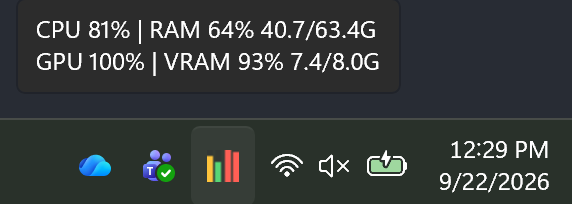

# trayTools

needed some tool tray tools

## TrayMeters

CPU, RAM, GPU and VRAM usage as a single Windows notification-area (system tray) icon.
Four vertical bars, left to right: **CPU, RAM │ GPU, VRAM** — grouped in pairs, with a
wider gap between the CPU/RAM pair and the GPU/VRAM pair.



Bars are coloured by load rather than by metric, so a hot resource is obvious at a glance:

| Load | Colour |
| --- | --- |
| < 70% | green |
| 70–89% | amber |
| ≥ 90% | red |

Hover the icon for exact numbers:

```
CPU 69% | RAM 58% 36.6/63.4G
GPU 100% | VRAM 93% 7.4/8.0G
```

Right-click for Task Manager, Resource Monitor, a **Start with Windows** toggle, and Exit.
Double-click opens Task Manager.

### Requirements

- Windows with Windows PowerShell 5.1 (ships with the OS) — uses WinForms/GDI+, so
  PowerShell 7 is not required.
- GPU/VRAM bars need an NVIDIA GPU with `nvidia-smi` on `PATH` (installed with the
  driver, normally at `%SystemRoot%\System32\nvidia-smi.exe`).

On a machine with no NVIDIA GPU it degrades gracefully to the original two-bar
CPU/RAM icon.

### Usage

```
wscript.exe "TrayMeters\TrayMeters.vbs"
```

`TrayMeters.vbs` is a thin launcher that starts the script with no console window.
To have it start automatically, right-click the tray icon and tick **Start with
Windows** — that writes a shortcut into your Startup folder pointing at the `.vbs`.

> The startup shortcut stores an absolute path. If you move this folder, re-tick the
> option (or fix the shortcut) so it keeps launching after login.

### How it works

- **CPU** — `Processor Information\% Processor Utility` performance counter, falling
  back to `% Processor Time` on systems where Utility isn't available.
- **RAM** — `Memory\Available MBytes` against `Win32_OperatingSystem.TotalVisibleMemorySize`.
- **GPU / VRAM** — `nvidia-smi --query-gpu=utilization.gpu,memory.used,memory.total`
  spawned **once** in `--loop=2` mode, with its stdout read line-by-line on a background
  thread by a small embedded C# helper (`TrayMetersGpu`).

  That indirection is deliberate. Invoking `nvidia-smi` from the 1.5s timer tick would
  cost ~50ms of the UI thread every time, and PowerShell's `Register-ObjectEvent` queue
  is not pumped reliably from inside `[Application]::Run`, so the conventional async-read
  pattern would silently never fire. If `nvidia-smi` dies (driver reload, sleep/resume,
  TDR) the thread backs off 5s and respawns, so the gauge can't freeze permanently.

The icon is redrawn into a fresh 16×16 bitmap each tick; `DestroyIcon` is called on the
interim handle from `GetHicon()` to avoid leaking GDI handles over a long uptime.

### Notes

- Bars track the **NVIDIA discrete GPU only**, not an Intel/AMD integrated GPU.
- VRAM reflects whatever is resident on the card, so a loaded local LLM will hold the
  VRAM bar high until the model is ejected.
- Tooltip text is kept under 64 characters: `NotifyIcon.Text` throws above that on
  .NET Framework.
- Bar geometry fills a 16px icon exactly and is centred at larger (high-DPI) icon sizes.
